<!-- README.md for Abhinav Papini -->

  

<h2 align="center">
  
</h2>

  

## 👋 Introduction

Hi, I'm **Abhinav Papini**, a tech-savvy and visually creative developer currently pursuing **B.Tech in Computer Science and Engineering** at **VNRVJIET**.

I’m passionate about building innovative tech solutions—whether it’s a chatbot solving legal issues, a platform democratizing education, or simply designing beautiful interfaces that delight users. My projects reflect a mix of **AI/ML exploration**, **full-stack development**, **UI/UX design**, and even **photography & video editing**.

From winning hackathons to organizing designathons and leading student clubs like **CSI**, **Stentorian**, and **VJMUNSOC**, I love being at the intersection of creativity, code, and community.

---

## 🚀 Featured Projects

| Project | Description | Tech Stack |
|---------|-------------|------------|
| ⚖️ **DharmaSetu** | AI-powered legal assistant platform for civic awareness | Next.js, Flask, MongoDB, Ollama, FAISS |
| 📚 **Edu Hub** | Course platform like Udemy/Coursera | MERN Stack |
| 🏋️ **Gym Analytics App** | Web app analyzing gym membership patterns | Python (Pandas), React, Express |
| 📝 **Blogosphere** | Role-based blogging platform | MERN Stack |
| ❓ **Quiz App** | Topic-based quiz app with scoring | MERN Stack |
| 🎮 **Python Game** | Arcade-style game using Turtle graphics & OOP | Python (Turtle) |
| 🚀 **ECFICIO Website** | Annual entrepreneurship fest site for college | MERN Stack |
| 🤖 **Legal Services Bot** | Chatbot for government & admission services | Langchain, Flask, Ollama, MongoDB |

## 💡 Skills & Tech Stack

### 🎨 Frontend Development

  

### ⚙️ Backend Development

  

### 🗄️ Databases & Cloud

  

### 🛠️ Tools & Development

  

## 🎯 Current Focus

```mermaid
graph TD
    A[🔍 Open Source Contributions] --> B[Hacktoberfest, GSOC]
    C[📖 Learning & Research] --> D[ML, NLP, Vector Search]
    C --> E[AI-based Civic Solutions]
    F[🤖 AI Development] --> G[Legal Bots & Chat Assistants]
    F --> H[Full-Stack Web Dev Projects]
    I[🎨 Creative Design] --> J[Video Editing, Photography]

    style A fill:#58A6FF,stroke:#1F6FEB,color:#fff
    style C fill:#58A6FF,stroke:#1F6FEB,color:#fff
    style F fill:#58A6FF,stroke:#1F6FEB,color:#fff
    style I fill:#58A6FF,stroke:#1F6FEB,color:#fff
```

## ✨ Fun Facts About Me

  

- 🎨 Blend of **design, storytelling, and development**  
- 💡 Organiser at **CSI**, **Stentorian**, **VJMUNSOC**  
- 📸 Passionate about **video editing, photography**, and **aqua sports**  
- 🧠 **Hackathon & Design-a-thon** enthusiast  
- 🌱 Always upskilling with **online certifications & new tools**

## 🔗 Let's Connect

  

    
    &nbsp;&nbsp;&nbsp;&nbsp;
    
    &nbsp;&nbsp;&nbsp;&nbsp;
    
    &nbsp;&nbsp;&nbsp;&nbsp;
    
    &nbsp;&nbsp;&nbsp;&nbsp;
    
  

  

  

  

