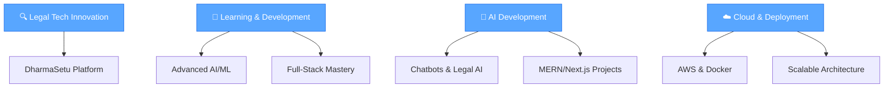

# Hi, I'm Abhinav Papini 👋

  

<h2 align="center">
  
</h2>

  

## 🚀 Featured Projects

| Project | Description | Tech Stack |
|---------|-------------|------------|
| ⚖️ **DharmaSetu** | AI-powered legal assistant platform for civic awareness | Next.js, Flask, MongoDB, Ollama, FAISS |
| 📚 **Edu Hub** | Complete course platform like Udemy/Coursera | MERN Stack |
| 💪 **Gym Analytics App** | Web app analyzing gym membership patterns | Python (Pandas), React, Express |
| 📝 **Blogosphere** | Role-based blogging platform with advanced features | MERN Stack |
| 🧠 **Quiz App** | Interactive topic-based quiz app with scoring | MERN Stack |
| 🎮 **Python Game** | Arcade-style game using Turtle graphics & OOP | Python (Turtle) |
| 🎪 **ECFICIO Website** | Annual entrepreneurship fest site for college | MERN Stack |
| 🤖 **Legal Services Bot** | AI chatbot for government & admission services | Langchain, Flask, Ollama, MongoDB |

## 💡 Skills & Tech Stack

### 🎨 Frontend Development

  

### ⚙️ Backend Development

  

### 🗄️ Databases & Cloud

  

### 🤖 AI & Machine Learning

  

### 🛠️ Tools & Development

  

## 🎯 Current Focus

```mermaid
graph TD
    A[🔍 Legal Tech Innovation] --> B[DharmaSetu Platform]
    C[📖 Learning & Development] --> D[Advanced AI/ML]
    C --> E[Full-Stack Mastery]
    F[🤖 AI Development] --> G[Chatbots & Legal AI]
    F --> H[MERN/Next.js Projects]
    I[☁️ Cloud & Deployment] --> J[AWS & Docker]
    I --> K[Scalable Architecture]
    
    style A fill:#58A6FF,stroke:#1F6FEB,color:#fff
    style C fill:#58A6FF,stroke:#1F6FEB,color:#fff
    style F fill:#58A6FF,stroke:#1F6FEB,color:#fff
    style I fill:#58A6FF,stroke:#1F6FEB,color:#fff
```

- ⚖️ **Legal Tech Innovation** with **AI-powered solutions**
- 🤖 Building **intelligent chatbots** and **legal assistants**
- 📚 Developing **educational platforms** and **analytics tools**
- 🚀 Creating **full-stack applications** with modern frameworks
- ☁️ Learning **cloud deployment** and **scalable architecture**
- 🎯 Focused on **civic awareness** and **legal accessibility**

## ✨ What Makes Me Unique

  

- ⚖️ Passionate about **legal technology** and **civic awareness**
- 🔍 Combining **AI/ML** with **real-world problem solving**
- 🎯 Building solutions that make **legal services accessible**
- 🌟 Always exploring **innovative technologies** and **best practices**
- 📚 Committed to **continuous learning** and **skill development**
- 🤝 Believe in **technology for social good**

## 📊 GitHub Stats

  

  

  

## 🌐 Let's Connect & Collaborate!

  

    
    &nbsp;&nbsp;
    
    &nbsp;&nbsp;
    
    &nbsp;&nbsp;
    
    &nbsp;&nbsp;
    
  

## 🎪 Fun Zone

  

  

---

  

  

---

  💡 <strong>Turning ideas into reality, one commit at a time!</strong>

